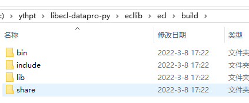
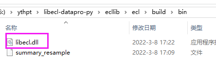
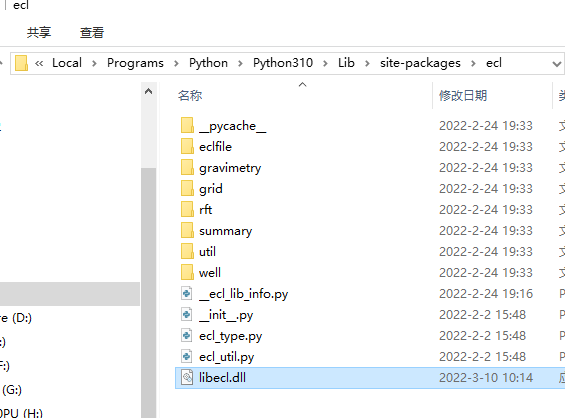

# libecl

#### 介绍

windows下msvc和cmake编译后的VS SLN解决方案
libecl是eclipse油藏数值模拟器文件读写的c/c++算法库

从https://github.com/Equinor/ecl克隆代码后，经过一番折腾，在windows（win10）下编译生成了dll，并能在Python中调用。这里因为折腾花了时间，直接将SLN备份。

该dll是非托管的C++生成，本人对VC不熟悉，在.Net下的winform或wpf不能直接调用，就在Python中使用了。

#### 环境

1. VS2022  C++语言
2. Python 3.10
3. CMake（官网下载的exe）
4. Conan（官网下载的exe）

#### 使用说明

1. 编译参见https://blog.csdn.net/Higer2008/article/details/123368297xxx
2. 生成的结果目录，build文件夹中包含bin、include和lib，具体参看本仓

   
3. libecl.dll在bin文件夹下

   
4. 在python工程中使用时，可能会提示找不到，根据提示路径，将该dll复制到对应位置，就能畅通使用了。我的路径在C:\Users\\Higer\AppData\Local\Programs\Python\Python310\Lib\site-packages\ecl

   
